Hello there. I am just a Computer Science Fresher starting out my journey into building projects and hackathons. I love writing guides too like my [Translucent Win11 Guide](<https://github.com/HyperZx2O/Translucent-Win11>). This is a similar guide for starting out projects, will bring changes in it the more I study about them.

Basically I studied some youtube videos, got the gist of developing projects using coding agents, then thought why not polish my basic workflow? So I sat down with Claude, discussed and debated with it and finally made a foundation for my workflow. And I love sharing my guides so here you go. Also I will share the resources worth mentioning in the relevant section.

This workflow has been reviewed against a handful of international benchmarks - GitHub Spec Kit, AWS Kiro, BMAD Method, Universal Dev Standards, Augment Code's SDD guide, the DEV Community's 2026 SDD field guide, and a few others.

---

A structured, prompt-driven system for AI-assisted hackathon and software development. Built for small teams who want the discipline of a big engineering team without the overhead. Both the spec and the quickstart are merged here into one workflow.

**Designed for:** Hackathons, competitive projects, and multi-member development sprints

---

## Table of Contents

- [Resources](#resources)
- [What This Is](#what-this-is)
- [What You Need](#what-you-need)
  - [Tools](#tools)
  - [CLI and Skills Setup](#cli-and-skills-setup)
  - [Template Files](#template-files)
- [The Workflow, at a Glance](#the-workflow-at-a-glance)
- [Phase 0: Ideation](#phase-0-ideation)
- [Phase 1: Specification](#phase-1-specification)
- [Phase 2: Planning](#phase-2-planning)
- [Phase 3: Repository Setup](#phase-3-repository-setup)
- [Phase 4: Coding](#phase-4-coding)
- [Phase 5: Frontend Audit](#phase-5-frontend-audit)
- [Phase 6: Phase Transition Review](#phase-6-phase-transition-review)
- [Phase 7: Merging and Red Team](#phase-7-merging-and-red-team)
- [Why This Works](#why-this-works)
- [Solo Path](#solo-path)

---

## Resources

| Guide | What it is |
|-------|------------|
| [Hackathon video playlist](https://youtube.com/playlist?list=PLkD4ksZgZ-nrX6kCvfoCHJr3GyFRnbab3&si=D12eZtiTOfzjlIZM) | Video walkthrough of this workflow |
| [H2H guide](https://chaotech.in/h2h) | Hacking-to-Hackathon companion guide |

---

## What This Is

Most teams start a hackathon by opening a code editor and hoping for the best. This workflow does the opposite. It front-loads every decision, constraint, and plan into structured documents before a single line of code is written. The coding agent then executes against those documents phase by phase, and a human reviews every transition point.

The result: less debugging, fewer merge conflicts, no "wait, what are we building again" conversations at 3am.

The whole thing runs like a loop. Plan, code, test, review, and repeat. Each phase has a prompt to use and an exit condition to check. Nothing depends on memory or improvisation. The exit conditions are the guardrails: a phase is done when its checkboxes are ticked, not when it roughly feels done.

---

## What You Need

### Tools

- [**Claude**](https://claude.ai/) — for ideation, plan generation.
- [**OpenCode**](https://opencode.ai/) — your local AI coding agent that reads your directory and generates code. If your OpenCode quota ever runs out, switch over to Mimo Code rather than stopping.
- [**Mimo Code**](https://mimo.xiaomi.com/coder) — an OpenCode clone but with Mimo models.
- [**Freebuff**](https://freebuff.com/) — another coding agent I like that gives you 6 hour free coding sessions daily.
- [**Git**](https://git-scm.com/) — one branch per team member, nobody pushes to main directly
- [**Terax**](https://terax.app/) or another terminal emulator — worth using in place of Powershell

### CLI and Skills Setup

Install these globally before any project. The same skills then work in whichever coding agent you land on.

| Skill | Purpose | When to load | Install |
|-------|---------|--------------|---------|
| `ponytail` | Forces minimal, non-overengineered code | Every phase | `npx skills add DietrichGebert/ponytail` |
| `hallmark` | Anti-slop UI generation — picks structure and theme before building | Frontend build phases | `npx skills add nutlope/hallmark` |
| `impeccable` | 59-rule UI audit — catches AI design slop after generation | Frontend audit phases | `npx impeccable install` |

---

### Template Files

The repo ships with template files you copy into each project, fill in, and return from:

```
context/
├── readme.md
├── idea.md
├── spec.md
├── plan.md
├── phase-review.md
└── postmortem.md
```

At the start of a project, copy these into your repo and fill them out. The originals stay untouched. After a project, update the originals based on what you learned. That return loop is what makes the system get smarter.

---

## The Workflow, at a Glance

The whole flow, from idea to post-mortem:

```mermaid
flowchart TB
    A[Phase 0: Ideation<br/>idea.md] --> B[Phase 1: Specification<br/>spec.md]
    B --> C[Phase 2: Planning<br/>plan-&#91;name&#93;.md]
    C --> D[Phase 3: Repo Setup<br/>AGENTS.md, branches]
    D --> E[Phase 4: Coding]
    E --> F{Phase 5: Frontend Audit}
    F --> G[Phase 6: Phase Review]
    G -->|next phase| E
    G -->|done| H[Phase 7: Red Team + Merge]
    H --> I[Postmortem<br/>postmortem.md]
    I -.->|return loop| A
```



---

### Phase 0: Ideation

**Tool:** Claude

**File:** `idea.md`

Upload the official hackathon document as a file. Fill your `idea.md` template with event name, theme, team size, roles, constraints, and ambition level, and send both to Claude.

**Prompt:**
```
Here is the official hackathon document [attached file] and my project context:

[paste filled idea.md]

Generate 8 ideas. For each idea:
- One-line concept
- Core problem it solves
- Who the user is
- The single most impressive thing a judge would see in the demo
- Realistic scope for [X] hours with [Y] team
- Biggest technical risk

After the list, recommend the top 2 based on my judging criteria and team strengths.
```

Pick one idea and sharpen it. One-sentence pitch, what the demo moment looks like, and what gets cut if time runs out. Record these decisions in Section 6 of idea.md as you make them.

**Exit condition:** every checkbox in the idea.md Ready Check is ticked. All must be YES before moving.

---

### Phase 1: Specification

**Tool:** Claude (same chat)

**File:** `spec.md`

After you're done finalizing your idea with Claude, upload the `spec.md` to it with the following prompt:

**Prompt:**
```
Here is the spec template. 
Based on everything we've discussed about this project — the idea, the users, the constraints, and the tech choices — fill this out completely and in detail. Remove any `[CONDITIONAL]` sections that don't apply to this project type. Never leave a field blank; if something is genuinely not applicable, write "N/A" with a one-line reason. 
For the architecture, data flow, and acceptance criteria sections, be especially thorough — these are what the coding agent relies on most. Be ruthless about scope: if we didn't discuss it, it goes in Out of Scope, not in Must-Have. 
This file is the single source of truth. Everything the coding agent builds will trace back to it.
```


**Exit condition:** Every must-have feature has a testable EARS-format acceptance criterion (`WHEN [trigger] THE [system] SHALL [behave]`).

---

### Phase 2: Planning

**Tool:** Claude (same chat)
**File:** `plan.md` (one per team member)

At first, ask Claude to divide the project to your team members, it will allocate stuff like frontend, backend etc.

Create a plan per team member that covers that person's full scope from start to finish. Each plan selects the phases relevant to its role, and every acceptance criterion must be testable without waiting on another member's work first.

**Prompt:**
```
Here is spec.md: [attach]
Here is plan.md template: [attach]

Generate plan.md for [role]. 

Use the uploaded plan.md template structure as template. Pick only the phases for their scope.
Each phase must list tasks specific to their role. Acceptance criteria must be
independently testable, no other member's work required first.
```

**Exit condition:** every member has a plan; every acceptance criterion maps to a feature in spec.md.

---

### Phase 3: Repository Setup

**Tool:** Git + OpenCode

1. Create the repo
2. Create a branch per member. The one exception is shared foundation work. Nobody pushes to main directly.
3. Create the context folder in the repo root:

```
context/
├── spec.md
└── plan-[name].md    ← one per member
```

4. Run OpenCode's  `/init` command which will generate AGENTS.md by analyzing the directory. This auto-generates the rules file for the project in the root directory. Don't write it manually. It then applies your summarized habits in every session.
5. Build any shared foundation work (data models, folder structure, environment setup) on main before people branch off.

**Exit condition:** repo, branches, context folder, and root AGENTS.md exist; the shared foundation runs.

---

### Phase 4: Coding

**Tool:** OpenCode

**Files:** context folder

Every coding session starts the same way.

**Session start prompt:**
```
Read these files before doing anything:
- context/spec.md
- context/plan.md

Skills active this session: ponytail [+ hallmark or impeccable by phase — see table]

Do not write any code yet. Confirm you have read them by summarizing:
1. What this project does
2. What your role is responsible for
3. What phase we are currently on
4. What the acceptance criteria are for this phase


**Skills by phase type:**

| Phase type | Skills to load |
|-----------|---------------|
| Backend, logic, API | `ponytail` |
| New UI built from scratch | `ponytail`, `hallmark` |
| UI audit and iteration | `ponytail`, `impeccable` |
```

Then, put the prompt below in the plan mode of OpenCode (or whatever coding agent you're using) (Press Tab in OpenCode to change modes from Plan to Build and viceversa).

**Phase start prompt:**
```
Implement Phase [N]: [Phase Name] from my plan.

Rules:
- Finish every task in this phase before touching a future phase
- After every file you create or modify:
  1. Run the test or type check for that file
  2. Run the full suite
  3. Report both results before touching the next file
- Do not proceed if either check fails
- Do not advance to Phase [N+1] until all of Phase [N] passes
- If something falls outside the spec or plan, stop and ask. Don't invent a fix
```
Replace N with whatever phase you're working on based on your plan.md file.

**If the agent loops on the same error twice or more:**
```
Stop fixing this. Don't modify any files.

Explain in plain language:
1. What the error actually is
2. Why your earlier fixes failed
3. Three ways to fix it and the trade-off of each

Then wait for my decision before touching anything.
```

**For sessions past 2 hours:** re-read `spec.md` and your plan, confirm which phase and task is next, and keep going.

---

### Phase 5: Frontend Audit

**Tool:** OpenCode (Hallmark + Impeccable)

**When:** after any phase that produces UI

Run the Hallmark audit, the Hallmark study, and the Impeccable audit together, present one table, fix once. Have the agent merge them into a single table:

**Prompt:**
```
Run a Hallmark audit on the project, then run an Impeccable audit too.

Present a single merged table with:
- Issue found
- Which skill flagged it (Hallmark / Impeccable / Both)
- Recommended fix

If two skills call out the same issue, list it once as "Both".
Single-skill flags get that skill's name.
```

Fix the "Both" rows first, then apply your own judgment to the single-skill findings and fix everything in one pass. This gives you a thorough review of the design and concrete suggestions to improve it, not a binary pass.

**Exit condition:** all "Both" rows fixed, the single-skill findings judged, and the fixes applied in one pass.

---

### Phase 6: Phase Transition Review

**Tool:** You (human) + the coding agent

**When:** before every phase change, never skip this during pressure


Use the following prompt to self-review the agent's own work:

```
Before we move to Phase [N+1], review everything built in Phase [N].
Don't modify any files.

Report:
1. Tasks from the plan that are incomplete or missing
2. Hardcoded values that should be env vars
3. Unhandled error states
4. Tests that could false-pass
5. Anything built that wasn't in the plan
6. Whether every acceptance criterion in the spec is verifiably met

Is this phase genuinely done, or does something need fixing first?
```

**Exit condition:** agent reports a clean pass AND your manual check passes. Fill in the Phase Completion Sign-Off in phase-review.md; if the spec changed, update the Change Log in spec.md.

---

### Phase 7: Merging and Red Team

**Tool:** OpenCode (new session preferable)

**When:** a plan is done

Get a fresh eye on everything that was committed:

**Red-team review prompt:**
```
Read the following files completely before doing anything:
- context/spec.md
- context/plan-[name].md

Then scan the entire codebase — every file this member was responsible for.

Cross-reference what exists in the codebase against every task and acceptance 
criterion in plan-[name].md. Then review as a senior engineer.

Report in this exact order:

1. COVERAGE — For every phase and task in plan-[name].md, state whether it is 
   fully implemented, partially implemented, or missing entirely. Be specific 
   about what is missing.

2. SPEC DRIFT — Does what was built match what spec.md required? List every 
   deviation, no matter how small.

3. BUGS & ERRORS — Obvious bugs, unhandled error states, missing edge cases, 
   hardcoded values that should be environment variables.

4. SECURITY — Any credentials, keys, or sensitive data exposed. Any input that 
   is not validated. Any endpoint that is not protected when it should be.

5. SCOPE CREEP — Anything built that does not appear in plan-[name].md or
   spec.md. List the file and the specific addition.

6. MERGE RISK — Any file, function, or data structure likely to conflict with 
   other members' branches based on PLAN-SHARED conventions and overlapping 
   scope.

7. VERDICT — Is this branch ready to merge to main, or does something need 
   fixing first? List every blocking issue explicitly.

Be blunt. Do not soften findings. Do not mention anything positive unless 
it is directly relevant to a finding.
```

Fix anything flagged, then merge to main.

### Publishing

Ask your coding agent how to publish the codebase to GitHub and suggest how to deploy. Let it guide you, but do the actual publish and deploy steps manually. When you're live, expect issues to surface even if the local code was flawless, so keep a cleanup routine: open the browser console (inspect), copy the errors, and hand them to the coding agent to chase every time. You can also check your deployment provider's log for errors.

---


## Why This Works

Most AI coding failures come from one of three causes:

1. The agent didn't know what to build, fixed by spec.md and its EARS-format criteria
2. The agent built the wrong thing and nobody noticed until late, fixed by phase-review prompt at every transition
3. Everyone's work didn't fit together, fixed by the per-member plans

The workflow doesn't eliminate AI mistakes. It catches them cheaply, before they compound into hours of repair cost.

---

## Solo Path

The team flow above covers a few teammates. If it's just you, drop the multi-branch rule: work in one branch, use everything else just the same. One person asks Claude for spec + plan, runs the agent phase by phase with testing, audits the UI, deploys, and debugs from console logs. You are the review that the whole team flow would use.

---

That's the whole thing. It's not perfect, and I'll keep tweaking it as I run more hackathons and find what breaks. If you take one thing from this, let it be the spec: the discipline of writing down what you're building before you build it saves you more than everything else I've spent time on here. Use it, break it, tell me what went wrong.
